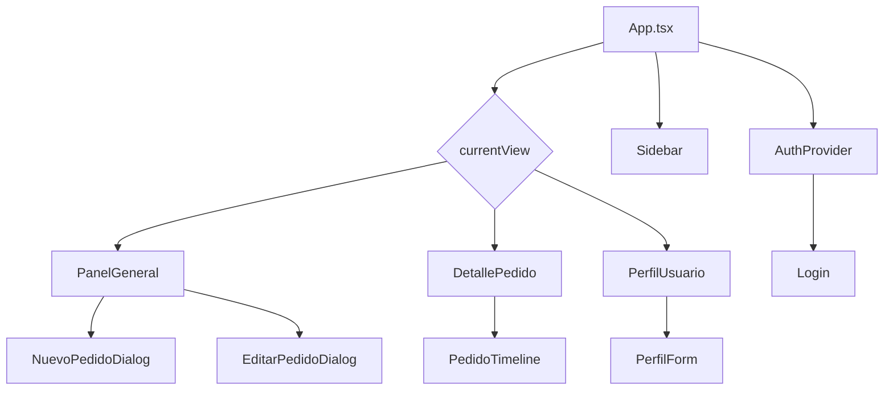
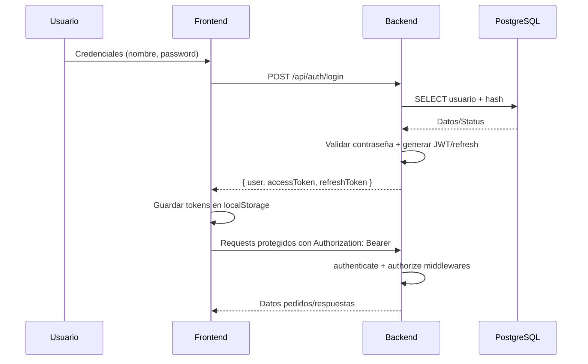
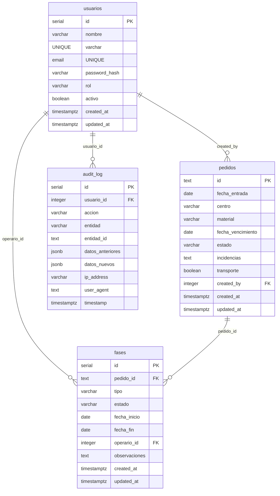
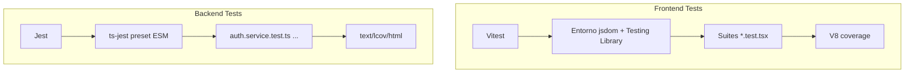
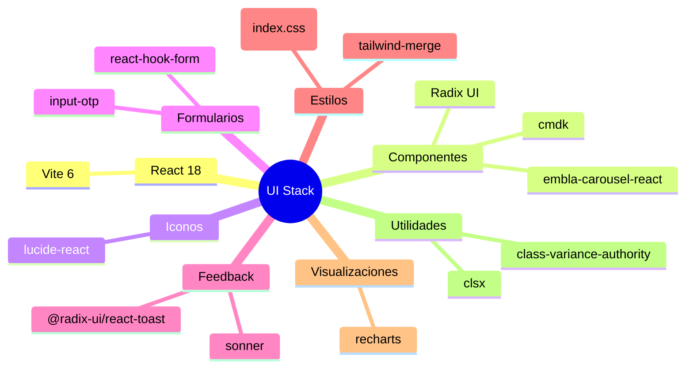

## Arquitectura General
```mermaid
graph LR
    User[Operario/Admin] -->|HTTPS| Browser[SPA React]
    subgraph Frontend
        Browser --> AuthCtx[AuthContext / Hooks]
        Browser --> APIClient[Funciones fetchPedidos/create/update]
    end
    APIClient -->|REST JSON + JWT| ExpressAPI[Servidor Express]
    subgraph Backend
        ExpressAPI --> Routers[Routers / Middlewares]
        Routers --> Services[Servicios (auth, pedidos)]
        Services --> PGPool[Pool PostgreSQL]
    end
    PGPool -->|SQL| PostgreSQL[(Base de datos)]
```

## Estructura SPA


## Flujo JWT


## Rutas Backend
```mermaid
graph LR
    A[Router /api/auth] -->|POST| Register
    A -->|POST| Login
    A -->|POST| Refresh
    A -->|GET| Me
    A -->|POST| ChangePassword
    P[Router /api/pedidos] -->|GET| ListPedidos
    P -->|GET| PedidoById
    P -->|POST (Admin/Oficina)| CrearPedido
    P -->|PUT (Roles específicos)| ActualizarPedido
    P -->|DELETE (Admin)| BorrarPedido
    subgraph Middlewares
        Authenticate --> Authorize
    end
    Middlewares --> A
    Middlewares --> P
```

## Esquema Base de Datos


## Pipeline de Despliegue
```mermaid
flowchart LR
    start[[Clonar repo]]
    start --> envs[Configurar .env front y backend]
    envs --> installFE[npm install (root)]
    envs --> installBE[npm install (backend/)]
    installBE --> devBE[npm run dev (backend)]
    installFE --> devFE[npm run dev]
    devFE -->|Build| buildFE[npm run build -> dist/]
    devBE -->|Build| buildBE[cd backend && npm run build]
    buildBE --> startBE[npm start (backend/dist)]
    buildFE --> ServeStatic[Servir dist/ con nginx/CDN]
```

## Pipeline de Testing


## Librerías de UI

